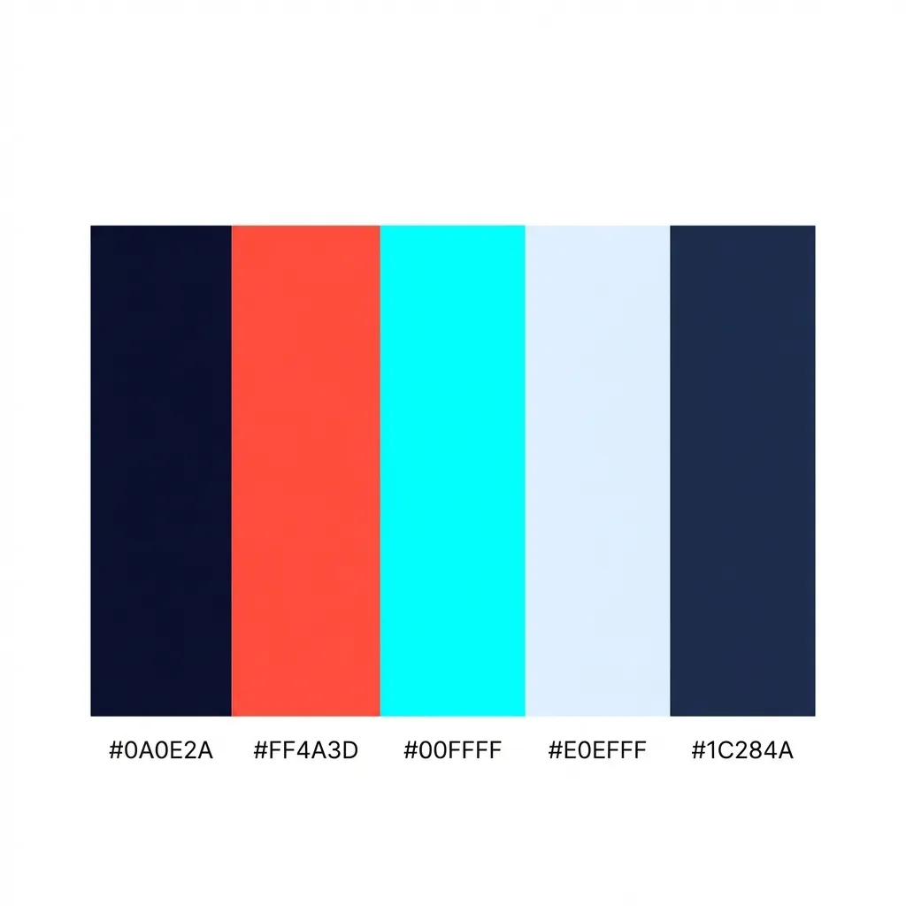

# Design Identity: BigCalendar — Retro Coder Edition

---

## Core Concept

**Terminal meets time.** A calendar that looks like it was built by a programmer who never left the green-screen era — but runs natively on modern macOS with crisp rendering, pixel-perfect precision, and zero ornamentation.

The vibe: a sysadmin's desk in 1987. Phosphor glow. Monospace grids. Utilitarian beauty.

---

## Typography

- **Monospace exclusively.** Every character: `SF Mono`, `Menlo`, or `Courier`. No exceptions.
- Day numbers are fixed-width, aligned as if in a data table.
- Month headers read like terminal output: `MAR 2026` — uppercase, no decoration.
- Letter-spacing is tight. Line-spacing is generous. Grids feel like printed registers.

---

## Color Palette

Five colors, two modes:

| Swatch | Hex | Role |
|---|---|---|
|  | `#0A0E2A` | Background (dark) |
|  | `#FF4A3D` | Today accent / accent chrome |
|  | `#00FFFF` | Primary text (dark) |
|  | `#E0EFFF` | Background (light) |
|  | `#1C284A` | Dimmed / secondary (dark) |

**Dark mode**
| Role | Token | Hex |
|---|---|---|
| Background | `WidgetBackground` | `#0A0E2A` — deep navy |
| Primary text | `PrimaryText` | `#00FFFF` — cyan phosphor |
| Today block | `TodayAccent` | `#FF4A3D` — coral red |
| Dimmed / past / out-of-month | `DimmedText` | `#1C284A` — muted navy |
| Accent (app chrome) | `AccentColor` | `#FF4A3D` |

**Light mode**
| Role | Token | Hex |
|---|---|---|
| Background | `WidgetBackground` | `#E0EFFF` — pale blue |
| Primary text | `PrimaryText` | `#0A0E2A` — deep navy |
| Today block | `TodayAccent` | `#FF4A3D` — coral red |
| Dimmed / past / out-of-month | `DimmedText` | `#1C284A` — muted navy |
| Accent (app chrome) | `AccentColor` | `#FF4A3D` |

---

## Visual Language

- **Grid is king.** Days are cells in a table. No rounded bubbles, no soft shapes. Hard edges or hairline borders only.
- **Hairline separators** — 0.5px lines between weeks, like ledger rulings.
- **No icons.** Zero. Date numbers and text labels only.
- **Today marker** is a block cursor — a solid rectangle behind the day number, blinking optionally.
- **Column headers** (`SUN MON TUE`) are uppercase, dimmer than the data, like column labels in a report.
- Month boundaries are marked by a `────` rule or a label flush-left, like a section header in a config file.

---

## Layout

- Months are columns of data, not cards. They tile horizontally like terminal panels.
- No padding between months — just a vertical `│` separator.
- The whole widget reads like the output of `cal -3` or `ncal` — raw, columnar, honest.
- No shadows, gradients, or glassmorphism. Flat. Dead flat.

---

## Interaction / Animation (macOS app shell)

- **No animations.** State changes are instant — like a terminal redraw.
- Hover states: invert foreground/background (block highlight), not a soft tint.
- Scrolling between month sets: no easing. Cut. Or at most a scanline wipe.
- Cursor is a system default — no custom cursors.

---

## Micro-details

- The widget frame, if visible, has a `1px` solid border — the window chrome of an old terminal emulator.
- Today's date might display as `▌26▌` — flanked by block characters.
- Past months are rendered at ~40% opacity — like history in a log file.
- "Current" month column has full brightness. Future: ~70%.
- Optional: a subtle scanline overlay (`repeating-linear-gradient` at ~3% opacity) to simulate CRT glass.

---

## What It Explicitly Rejects

- Rounded corners on day cells
- Drop shadows
- SF Pro / any sans-serif
- Color gradients
- Emoji or iconography
- Animations with easing curves
- "Friendly" language — it's a data display, not a lifestyle product

---

## Tagline (internal)

> **"It's just `cal`. But yours."**
